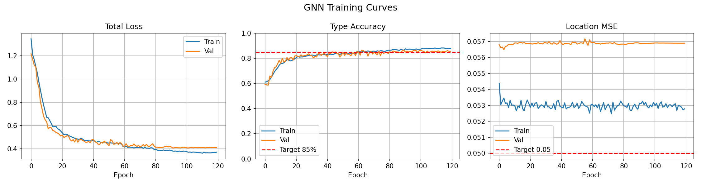
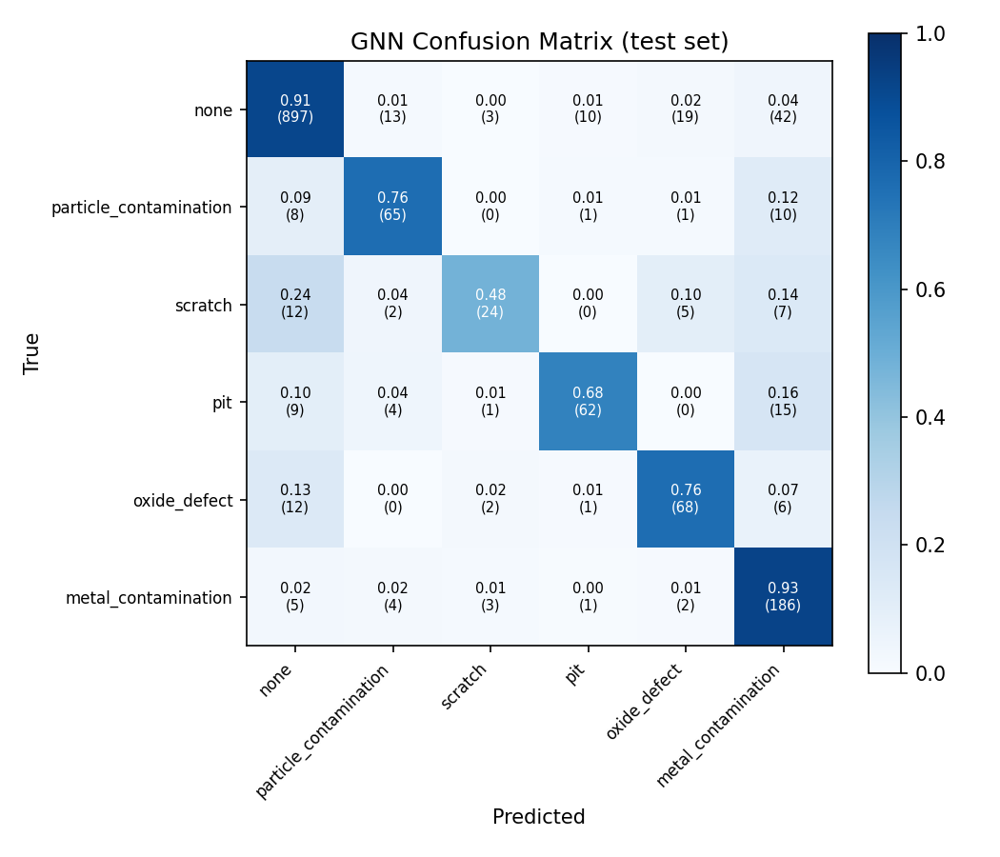
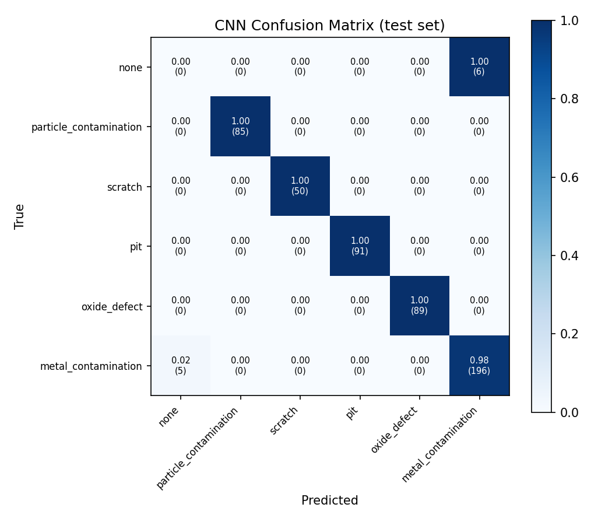
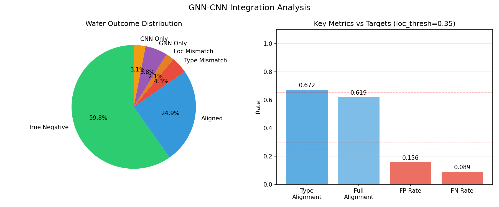
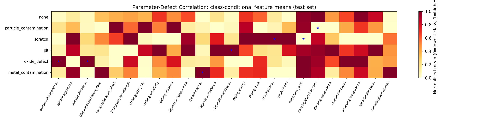

# FabEye

**End-to-end ML pipeline for semiconductor wafer defect prediction and detection.**

FabEye combines a Graph Neural Network (GNN) that predicts defects from process parameters with a Faster R-CNN that detects defects in wafer inspection images. An integration layer cross-validates the two stages — answering whether parameter anomalies identified before inspection actually produce the visual defects seen afterward.

[](https://www.python.org/)
[](https://pytorch.org/)
[](https://pyg.org/)
[](https://streamlit.io/)
[](LICENSE)

---

## Results

| Model | Metric | Value | Target |
|-------|--------|-------|--------|
| GNN | Type Accuracy | **86.8%** | >85% |
| GNN | Location MSE | **0.054** | <0.05 |
| GNN | Inference Time | **10.4 ms** | <30 ms |
| CNN | Precision | **98.3%** | — |
| CNN | Recall | **98.5%** | — |
| CNN | F1 Score | **98.4%** | — |
| CNN | Inference Time | **68.7 ms** | <150 ms |
| Integration | Type Alignment | **67.2%** | >65% |
| Integration | Full Alignment | **61.9%** | — |
| Integration | FP Rate | **15.6%** | <30% |
| Integration | FN Rate | **8.9%** | <25% |

---

## Architecture

```
Process Parameters (8 steps × 3 params each)
        │
        ▼
┌───────────────────┐
│  Graph Neural Net │  ← nodes = process steps, edges = causal dependencies
│  (GCN + GAT + MLP)│
└─────────┬─────────┘
          │  type, location, severity predictions
          │
          ▼
┌──────────────────────────────┐
│      Integration Layer       │  ← cross-validates both stages
└──────────────┬───────────────┘
          ▲    │
          │    ▼
┌─────────────────────┐
│  Wafer Image (512²) │
│  Faster R-CNN       │  ← ResNet-50 backbone + RPN
│  (bbox, class, conf)│
└─────────────────────┘
```

---

## Visualisations

### GNN Training Curves


### GNN Confusion Matrix


### CNN Confusion Matrix


### Integration — Alignment Analysis


### Parameter–Defect Correlation Heatmap
*Class-conditional feature means across 24 process parameters and 6 defect types. Blue ★ marks known causal relationships from the data generator.*



---

## Project Structure

```
fabeye/
├── data/
│   ├── generator.py          # Synthetic process parameter generation (10k wafers)
│   ├── image_generator.py    # Synthetic wafer SEM image generation
│   ├── loader.py             # PyG DataLoaders (GNN)
│   └── image_loader.py       # Standard DataLoaders (CNN)
│
├── models/
│   ├── gnn.py                # DefectPredictionGNN  (GCN + GAT layers)
│   └── cnn.py                # DefectDetectionCNN   (Faster R-CNN / ResNet-50)
│
├── training/
│   ├── train_gnn.py          # GNN training script
│   ├── train_cnn.py          # CNN training script
│   ├── gnn_trainer.py        # GNNTrainer class
│   └── cnn_trainer.py        # CNNTrainer class
│
├── evaluation/
│   ├── alignment.py          # GNNCNNComparison — core integration logic
│   ├── analyze_alignment.py  # Master Week 5 analysis script
│   ├── metrics.py            # DefectMetrics helpers
│   └── visualizations.py     # Confusion matrix, wafer overlay plots
│
├── database/
│   ├── db_utils.py           # DatabaseManager (SQLAlchemy ORM)
│   └── schema.sql            # PostgreSQL table definitions
│
├── visualization/
│   └── dashboard.py          # Streamlit dashboard (6 tabs)
│
├── results/                  # Saved plots + JSON metrics (committed)
├── checkpoints/              # Model weights (gitignored)
├── data/raw/                 # Generated JSON data (gitignored)
└── data/wafer_images/        # Generated PNG images (gitignored)
```

---

## Getting Started

### Prerequisites

- Python 3.8+
- CUDA 11.0+ (optional — CPU works)

### Installation

```bash
git clone https://github.com/anson10/FabEye.git
cd FabEye
python -m venv venv
source venv/bin/activate       # Windows: venv\Scripts\activate
pip install -r requirements.txt
```

### Running the Full Pipeline

```bash
# 1. Generate synthetic data (creates data/raw/ and data/wafer_images/)
python3 data/generator.py --n 10000
python3 data/image_generator.py

# 2. Train GNN
PYTHONPATH=. python3 training/train_gnn.py

# 3. Train CNN
PYTHONPATH=. python3 training/train_cnn.py

# 4. Integration analysis (alignment metrics, confusion matrices, correlation heatmap)
PYTHONPATH=. python3 evaluation/analyze_alignment.py

# 5. Launch dashboard
PYTHONPATH=. streamlit run visualization/dashboard.py
```

---

## Dashboard

Six-tab interactive dashboard built with Streamlit:

| Tab | Contents |
|-----|----------|
| **Dataset** | Wafer count, defect class distribution, sample parameters |
| **GNN Results** | Accuracy/MSE metrics, training curves, confusion matrix |
| **CNN Results** | Precision/recall/F1, detection examples |
| **Integration** | Alignment rates, outcome breakdown, per-defect analysis |
| **Parameter Correlations** | Process parameter vs defect type heatmap |
| **Wafer Inspector** | Live single-wafer inference with both models overlaid |

```bash
PYTHONPATH=. streamlit run visualization/dashboard.py
```

---

## Data Generation

All data is synthetic — no proprietary fab data is used.

**Process parameters** are generated for 8 manufacturing steps (oxidation, lithography, etching, deposition, doping, CMP, cleaning, annealing), each with 3 numeric parameters. Defect labels are assigned via physics-inspired causal rules — for example, high oxidation temperature → oxide defect, high CMP pressure + slurry concentration → pit.

**Wafer images** (512×512 RGB) are procedurally generated to match the parameter-level ground truth. Defect regions are rendered as Gaussian blobs, scratches, or irregular patches depending on defect type, with realistic background noise.

```
Defect classes: none · particle_contamination · scratch · pit · oxide_defect · metal_contamination
```

---

## Key Design Decisions

**Why GNN for parameters?**
Process steps have causal dependencies (temperature affects diffusion, which affects doping). A graph naturally represents these relationships, and message passing captures multi-hop interactions that a flat MLP would miss.

**Why Faster R-CNN?**
Defects vary in count, size, and location. Faster R-CNN's region proposal network handles variable object counts and produces both bounding boxes and class labels in one forward pass.

**Why type-based alignment as the primary metric?**
GNN location predictions are inherently noisier than type predictions (RMSE ≈ 0.23 per coordinate on normalised [0,1] space). Type alignment captures the more meaningful signal — whether both models agree on *what* defect is present.

**Why SQLite/PostgreSQL for logging?**
Every training run and integration result is logged to a structured database so experiments are reproducible and queryable. SQLAlchemy ORM supports both SQLite (local dev) and PostgreSQL (production) with no code changes.

---

## Database

Results are logged automatically via `DatabaseManager`:

```python
from database.db_utils import DatabaseManager

db = DatabaseManager()                      # SQLite: fabeye.db
db = DatabaseManager("postgresql://...")   # or PostgreSQL

exp_id = db.create_experiment("run_01", model_type="gnn", hidden_channels=256, ...)
db.log_epoch(exp_id, epoch=1, train_loss=1.34, val_type_acc=0.59, ...)
db.update_final_metrics(exp_id, type_accuracy=0.868, location_mse=0.054)
```

Tables: `experiments`, `epoch_metrics`, `checkpoints`, `alignment_results`

---

## Tech Stack

| Category | Libraries |
|----------|-----------|
| Deep Learning | PyTorch 2.0, PyTorch Geometric 2.3, TorchVision 0.15 |
| Data | NumPy, Pandas, OpenCV, Pillow |
| Database | SQLAlchemy 2.0, SQLite / PostgreSQL |
| Visualisation | Matplotlib, Plotly, Streamlit |
| Metrics | scikit-learn |

---

## License

MIT — see [LICENSE](LICENSE)

---

**Author:** Anson Antony · [hello@ansonantony.tech](mailto:hello@ansonantony.tech) · [@anson10](https://github.com/anson10)

*Co-authored with [Claude](https://claude.ai) (Anthropic)*

*Even wafers deserve a second opinion.*
