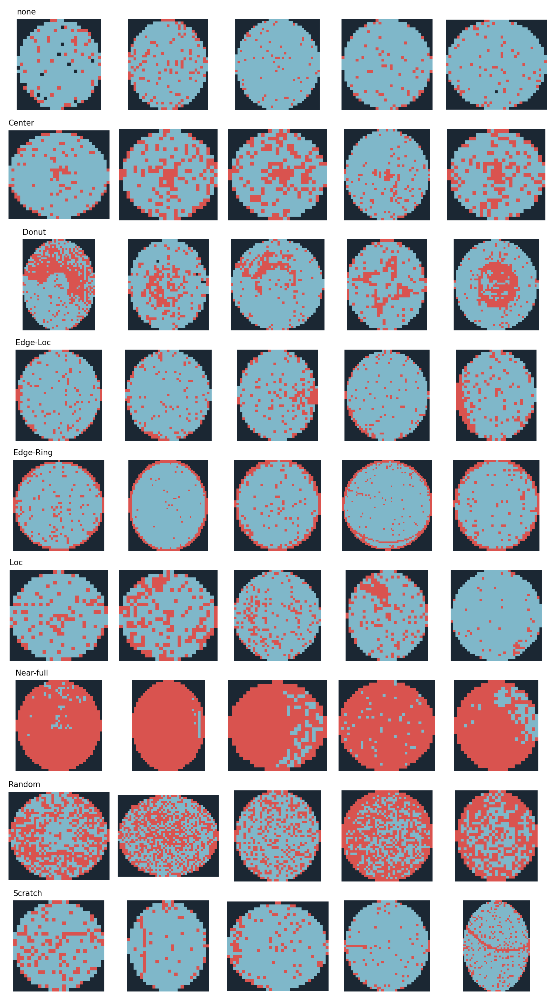
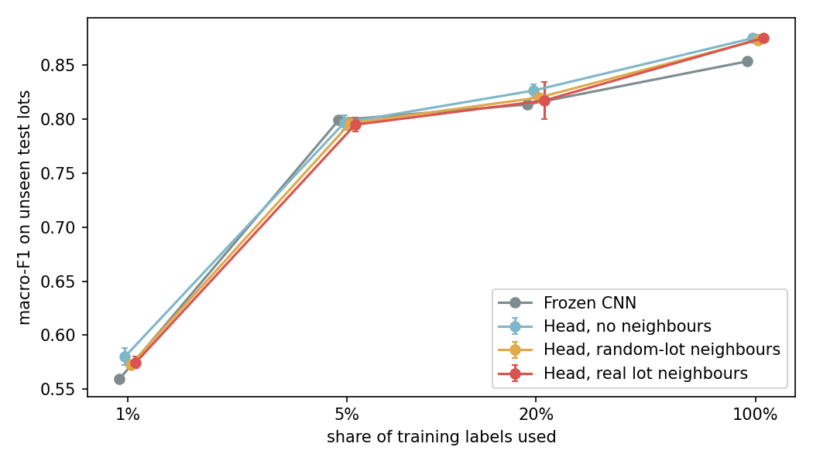
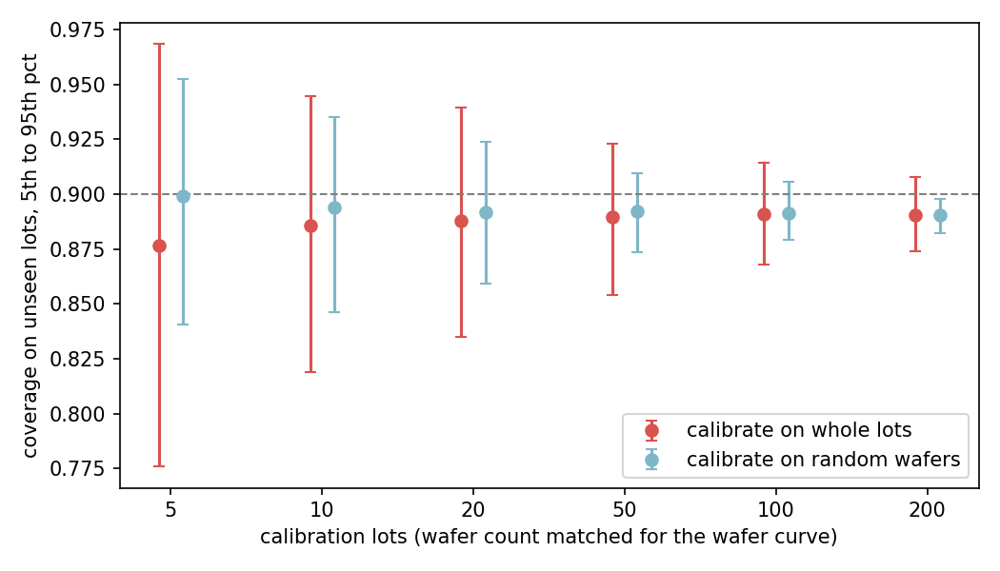

# FabEye

Wafer map failure pattern recognition on the real WM-811K dataset, with leakage-aware evaluation, calibrated uncertainty, and a deployable service.

The project asks what a fab would ask before trusting a classifier: does the score survive on lots the model has never seen, how often is it wrong on rare patterns, and when should a wafer go to an engineer? It also reports a hypothesis that did not pan out.



## Why this is different

Wafer-map classifiers on WM-811K are common. Most report accuracy on a random per-wafer split and stop there. Three things here are less common, and each is backed by a result below rather than asserted:

- **A leakage audit, not a claim.** Labels in this dataset cluster 92.7% within a lot against 23.7% by chance, so a random split lets a model see near-duplicates of its test wafers during training. Every model here is scored on both a random split and a lot-disjoint split, so the inflation is measured rather than assumed. For the CNN it turned out small, which is itself a checked fact, not a guess.
- **A tested hypothesis that failed, reported anyway.** A model that reads a wafer's lot neighbours was built to see if manufacturing context improves classification, with a no-neighbour control and a random-other-lot control, at four label budgets. It did not help at any of them. Most portfolios only show wins; a controlled negative result is rarer and makes the surrounding numbers more credible, not less.
- **Calibrated guarantees that hold on lots never seen, with their limits stated.** Conformal prediction sets are calibrated on one set of lots and tested on different ones. Plain calibration leaves one class covered only 55% of the time even at a 90% target, and calibrating on whole lots is measurably noisier than calibrating on the same number of random wafers.

What is not a differentiator: the CNN, GNN and random-forest comparison, the ONNX export, and the FastAPI service. Those are expected of a serious project, not unusual.

## Data

[WM-811K](https://www.kaggle.com/datasets/qingyi/wm811k-wafer-map) holds 811,457 wafer maps from 46,293 production lots. Only 172,950 carry an expert label across 9 patterns, and 85% of those are "none". Wu, Jang and Chen introduced it in IEEE Transactions on Semiconductor Manufacturing, 2015.

- **Lot-grouped split.** Whole lots are assigned to train, validation or test, so no lot appears in two splits. Rare classes are balanced greedily across splits.
- **Training set.** The "none" class is capped at 10,000 wafers. Validation and test keep the natural distribution.
- **Random split kept for comparison.** It measures how much per-wafer splitting inflates scores.

## Results

Every score is macro-F1 on the test set, which weights the rare patterns equally. Accuracy is misleading here because "none" is 85% of the data. Single seed unless stated.

### Models

| Split | Model | Macro-F1 | Accuracy | ms per wafer |
|---|---|---|---|---|
| Lot-grouped | Random forest on radial density features | 0.717 | 93.6% | 0.02 |
| Lot-grouped | CNN, 4 blocks on 64 x 64 maps | **0.858** | 96.5% | 0.30 |
| Lot-grouped | GraphSAGE on a die-level graph | 0.776 | 93.5% | 1.36 |
| Random | Random forest | 0.733 | 93.7% | 0.02 |
| Random | CNN | 0.857 | 97.1% | 0.27 |
| Random | GNN | 0.786 | 93.6% | 1.24 |

- The CNN is the strongest model and is the one that is deployed.
- The lot-grouped split barely changes the CNN score, so leakage was small for this model. That is a measured result, not an assumption.
- The GNN is weak on thin patterns. Scratch F1 is 0.23, against 0.76 for the CNN with a trained head.

### Does lot context help? No.

Wafers in a lot share tools and process history. In the raw labels, two defective wafers from one lot share a pattern 92.7% of the time, against 23.7% by chance. A small transformer refined each wafer's prediction using its lot neighbours' embeddings, never their labels.

| Head on frozen CNN | Macro-F1, 3 seeds |
|---|---|
| Frozen CNN only | 0.858 |
| No neighbours | 0.879 +- 0.002 |
| Neighbours from a random other lot | 0.863 +- 0.016 |
| Real lot neighbours | 0.877 +- 0.010 |

Real neighbours match the no-neighbour head, so lot context added nothing. Most of the gain over the frozen CNN comes from training a head at all.



The same holds when the CNN and head are trained on 1%, 5% or 20% of the labels. Real neighbours never beat the no-neighbour head by more than seed noise. The likeliest reason is that a wafer's own map already shows its pattern. Labels fall from 0.853 to 0.559 macro-F1 between 100% and 1% of labels, which is the real cost of scarce labels.

### Calibrated uncertainty on unseen lots

Class-conditional conformal prediction sets, calibrated on 1,612 validation lots and tested on different lots.

| Target coverage | Coverage on unseen lots | Worst class, marginal | Worst class, class-conditional |
|---|---|---|---|
| 90% | 89.3% | 54.5% | 86.2% |
| 95% | 94.7% | 71.4% | 87.5% |

- **Overall coverage holds, one point short.** The shortfall also appears with random wafer calibration, so it comes from lot-to-lot shift.
- **The average hides rare classes.** With plain calibration, Loc wafers were covered only 55% of the time at a 90% target. Class-conditional calibration lifts the worst class above 86%. Near-full still falls short with only 22 calibration wafers.
- **Whole lots calibrate less stably than random wafers.** At a matched wafer count, coverage varied 1.5 to 2.4 times as much across calibration sets. The effective sample size is closer to the number of lots.



**Review rule.** Auto-accept a wafer when confidence is at least 0.688. This is chosen so the error rate among accepted wafers stays under 2% with 90% confidence. On unseen lots, 96.2% of wafers were accepted at a 1.9% error rate. The guarantee needs many calibration lots. With 50 lots it accepted nothing.

### Serving latency

Model is the CNN exported to ONNX, checked against PyTorch to within 1e-5. CPU with 4 threads unless noted, on a laptop with an RTX 3050.

| Backend | Batch | Median ms | Wafers per second |
|---|---|---|---|
| PyTorch CPU | 1 | 7.07 | 141 |
| ONNX Runtime CPU | 1 | 3.11 | 347 |
| PyTorch GPU | 1 | 3.27 | 274 |
| PyTorch CPU | 32 | 190 | 169 |
| ONNX Runtime CPU | 32 | 79.6 | 412 |
| PyTorch GPU | 32 | 7.17 | 4,363 |

ONNX Runtime GPU was not measured because no GPU provider is installed.

## Quickstart

```bash
pip install -r requirements.txt
kaggle datasets download -d qingyi/wm811k-wafer-map -p data/wm811k --unzip

# Split by lot (default). Set WM_SPLIT=random for the leaky comparison split.
python data/wm811k.py
python training/train_wm.py --model rf  --seed 0
python training/train_wm.py --model cnn --seed 0
python training/train_wm.py --model gnn --seed 0 --bs 64

# Lot-context experiments
python training/extract_embeddings.py
python training/train_lot_context.py --seeds 3
python training/scarce_labels.py --seeds 3

# Conformal experiments
python training/run_conformal.py
```

Results land in `results/` as JSON, and checkpoints in `checkpoints/`. Training took about 10 minutes for the CNN and 40 for the GNN on an RTX 3050 6 GB.

## Serve it

```bash
python serving/export_onnx.py --ckpt checkpoints/wm_lot_cnn_seed0.pt
python training/scarce_labels.py --cache-only
python serving/calibrate.py
uvicorn serving.app:app --port 8000
```

Or with Docker:

```bash
docker build -t wafer-classifier .
docker run -p 8000:8000 wafer-classifier
```

```bash
curl -s localhost:8000/predict?alpha=0.05 -H 'Content-Type: application/json' -H 'X-API-Key: <key>' \
  -d '{"wafer_map": [[0,1,1,0],[1,1,2,1],[1,2,1,1],[0,1,1,0]]}'
```

A wafer map is a 2D grid with 0 outside the wafer, 1 for a good die and 2 for a failed die. Any size works.

| Endpoint | Auth | Purpose |
|---|---|---|
| `POST /predict` | required if `WAFER_API_KEY` is set | Pattern, confidence, conformal prediction set, and an auto-accept or review flag |
| `POST /predict/batch` | required if `WAFER_API_KEY` is set | Up to 64 wafers per request |
| `GET /calibration` | none | What the signals guarantee, how they behaved on unseen lots, and their limits |
| `GET /health` | none | Status, and whether the calibration file matches the loaded model |
| `GET /metrics` | none | Prometheus text: request counts and latency, plus prediction volume by pattern and the accept/review split |

The image is 681 MB, runs as a non-root user, and includes a health check. Run the service tests with `pytest tests/test_serving.py`.

**Auth, logging and metrics.** Set `WAFER_API_KEY` to require a matching `X-API-Key` header on the predict routes; leaving it unset disables auth and logs a startup warning, for local development only. Every request is logged as one JSON line with a request ID, also returned as the `X-Request-ID` response header. `WAFER_CORS_ORIGINS` (comma-separated, default `*`) controls which origins may call the API from a browser.

**Frontend.** `web/index.html` is a standalone static page — no build step, no framework — that calls `/predict` with `fetch()`. It holds no model weights and does no inference itself; open it directly or serve it with any static host (`python3 -m http.server` inside `web/` for local use) and point it at the running API's URL and key.

## Layout

| Path | Contents |
|---|---|
| `data/wm811k.py` | Loading, lot-grouped split, image and graph datasets |
| `models/wm_models.py`, `models/lot_context.py` | CNN, GNN and the lot-context head |
| `training/` | Training, embedding extraction, lot-context, label-scarcity and conformal experiments |
| `evaluation/conformal.py` | Conformal sets and selective risk control |
| `serving/` | ONNX export, calibration, benchmark, FastAPI app |

## Limitations

- **Single seed for the model comparison.** Only the lot-context head has three seeds.
- **Rare classes are noisy.** Near-full has 24 test wafers and Donut 87.
- **No probability calibration** was applied before the conformal step.
- **The GNN is not deployed.** Its scatter-based message passing does not export cleanly to ONNX.
- **Lots are one source.** Calibration guarantees assume new lots resemble the calibration lots. Labels may also reflect annotation habits that this project did not audit.
- **A lot-time split was not run.** WM-811K has no timestamps.

## Earlier work

This project replaces an earlier synthetic pipeline that paired a process-parameter GNN with a Faster R-CNN. That work, including its dashboard, database schema and dataset generators, lives in [legacy-v1/](legacy-v1/), with its own README at [legacy-v1/README.md](legacy-v1/README.md). A plain classifier scored 100% on its synthetic images, which is why the project moved to real data.

## License

MIT
